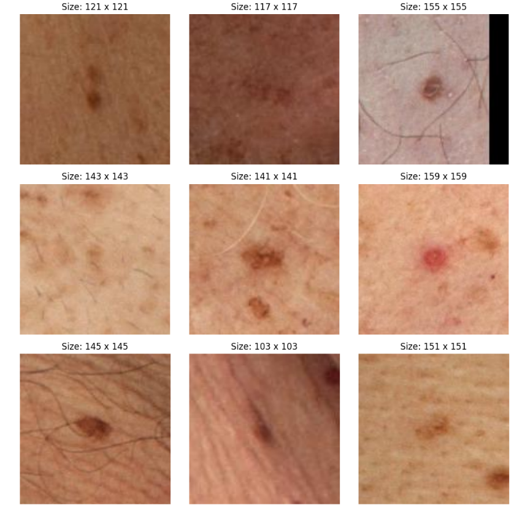
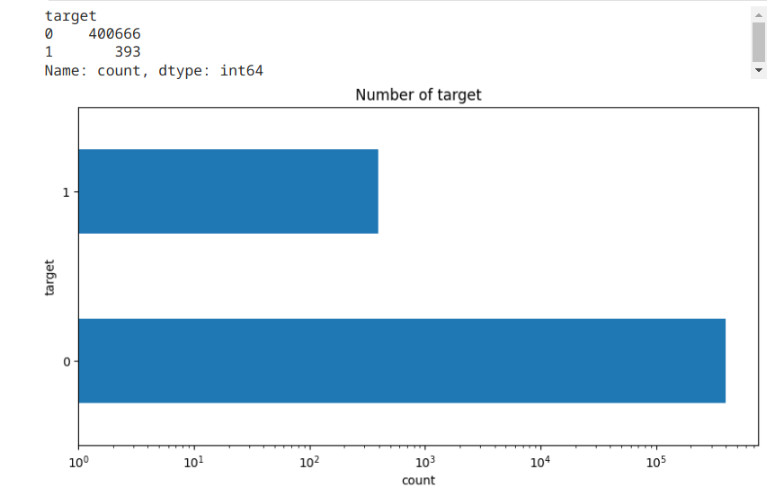
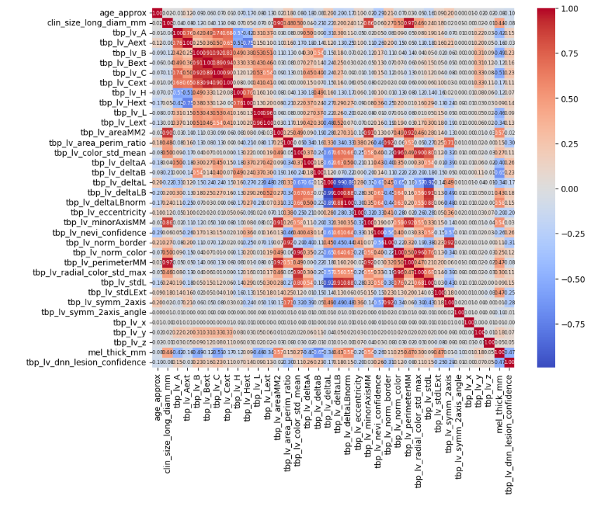

# Skin-Cancer-Detection

Kaggle hosts several datasets of skin lesion images.

You will find the data sets on the following link: https://www.kaggle.com/competitions/isic-2024-challenge/data

### The images vary in size, and the dataset is extremely unbalanced. 

### Evaluation results of the trained CNN are presented below.

